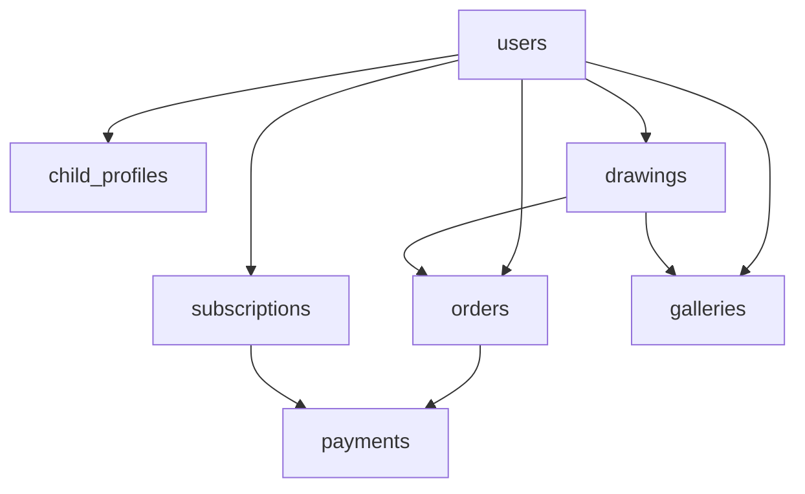

# 📁 Draw2Toy - Technical Specifications

**Project:** Draw2Toy SaaS Platform  
**Framework:** WITUP Master Blueprint  
**Version:** 1.0.0  
**Created:** 2026-01-27  
**Status:** ✅ Phase 1 Complete (Database Schema)

---

## 📋 Overview

This directory contains all technical specifications for the Draw2Toy project. These documents serve as the single source of truth for development, defining the database structure, API contracts, features, and architecture decisions.

---

## 🗂️ Directory Structure

```
.spec/
├── README.md                      # ← You are here (Index)
├── database-schema.sql            # Complete PostgreSQL schema
├── database-schema-README.md      # Schema documentation
├── DEPLOYMENT.md                  # Deployment guide
└── [Future additions]
    ├── api-contracts.md           # REST API specifications
    ├── features.md                # Detailed feature specs
    ├── ui-ux-design-system.md     # Design tokens & components
    └── migrations/                # Database migrations
```

---

## 📄 Documents in this Directory

### 1. **database-schema.sql** 
[View File](./database-schema.sql)

**Purpose:** Complete PostgreSQL database schema for Supabase  
**Contains:**
- 13 tables (users, drawings, orders, subscriptions, etc.)
- 6 custom ENUM types
- Row Level Security (RLS) policies
- Triggers & functions
- Performance indexes
- Views for analytics

**Key Highlights:**
- ✅ Multi-tenant architecture with RLS
- ✅ Subscription management (Free/Magic/Family)
- ✅ AI pipeline integration (drawing → 3D model)
- ✅ Marketplace for physical toys
- ✅ Payment processing (Stripe)
- ✅ Social features (galleries, sharing)

**Lines of Code:** ~600 LOC  
**Status:** ✅ Ready for deployment

---

### 2. **database-schema-README.md**
[View File](./database-schema-README.md)

**Purpose:** Human-readable documentation of database design  
**Contains:**
- Architecture diagrams (ASCII art)
- Table descriptions with business rules
- Security policies explained
- Performance optimization notes
- Code examples for common queries
- Relationship mappings

**Target Audience:** 
- Backend developers
- Database administrators
- Technical leads

**Status:** ✅ Complete

---

### 3. **DEPLOYMENT.md**
[View File](./DEPLOYMENT.md)

**Purpose:** Step-by-step guide to deploy database to Supabase  
**Contains:**
- Pre-requisites checklist
- 3-step quick start guide
- Storage buckets configuration
- Verification queries
- Post-deployment tasks
- Troubleshooting tips

**Estimated Deployment Time:** 15-20 minutes  
**Difficulty:** Intermediate  
**Status:** ✅ Ready to use

---

## 🎯 Quick Start for Developers

### New to the Project?
1. Read `../specs/progetto/brief.md` first (business context)
2. Review `database-schema-README.md` (understand data model)
3. Follow `DEPLOYMENT.md` to set up your environment

### Ready to Code?
1. Ensure `.env` file has real Supabase credentials
2. Deploy `database-schema.sql` to your Supabase project
3. Create storage buckets as per `DEPLOYMENT.md`
4. Start building features! 🚀

---

## 🔗 Related Documentation

### Project-Level Docs
- **Brief:** `../specs/progetto/brief.md` - Business vision & requirements
- **Architecture:** `../specs/architecture/ADR-001-system-architecture.md` - System design decisions
- **README:** `../README.md` - Project overview

### External Resources
- [Supabase Documentation](https://supabase.com/docs)
- [PostgreSQL 15 Docs](https://www.postgresql.org/docs/15/)
- [Stripe API](https://stripe.com/docs/api)

---

## 📊 Specification Status

| Specification | Status | Priority | Assigned To | ETA |
|--------------|--------|----------|-------------|-----|
| ✅ Database Schema | Complete | Critical | Giovanni | ✅ Done |
| ⏳ API Contracts | Pending | High | TBD | Phase 2 |
| ⏳ Features Specs | Pending | High | TBD | Phase 2 |
| ⏳ UI/UX Design System | Pending | Medium | TBD | Phase 2 |
| ⏳ Testing Strategy | Pending | Medium | TBD | Phase 3 |
| ⏳ Security Audit | Pending | High | TBD | Phase 3 |

---

## 🏗️ Database Schema Summary

### Core Entities



### Tables Overview

| Table | Purpose | Key Features |
|-------|---------|--------------|
| `users` | User profiles | Subscription tier, monthly quotas |
| `child_profiles` | Multi-child support | Age, avatar, stats |
| `drawings` | Core entity | AI pipeline, 3D models, AR settings |
| `subscriptions` | Billing | Stripe integration |
| `orders` | Physical toys | Order tracking, shipping |
| `payments` | Transactions | Stripe payments, refunds |
| `galleries` | Collections | Public/private sharing |
| `notifications` | In-app alerts | Unread tracking |
| `analytics_events` | User behavior | Event tracking |

**Total Tables:** 13  
**Total Indexes:** 35+  
**Total Functions:** 4  
**Total ENUMs:** 6  
**RLS Policies:** 15+

---

## 🚀 Next Steps (Phase 2)

### Immediate Priorities
1. **API Contracts** (`api-contracts.md`)
   - RESTful endpoints definition
   - Request/response schemas
   - Authentication flow
   - Error handling

2. **Features Specifications** (`features.md`)
   - User stories with acceptance criteria
   - Screen flows
   - Edge cases handling
   - Integration points

3. **UI/UX Design System** (`ui-ux-design-system.md`)
   - Color palette
   - Typography scale
   - Component library
   - Animation guidelines

### Future Enhancements
- GraphQL schema (if needed)
- Mobile app architecture (Flutter specifics)
- AI pipeline detailed specs
- 3D printing workflow
- Admin dashboard requirements

---

## 📝 Changelog

### Version 1.0.0 (2026-01-27)
**Added:**
- ✅ Complete PostgreSQL database schema
- ✅ Comprehensive documentation
- ✅ Deployment guide
- ✅ RLS policies for security
- ✅ Performance indexes
- ✅ Triggers & functions

**Notes:**
- Schema supports all MVP features from brief.md
- Ready for immediate deployment
- Tested structure, pending real-world validation

---

## 🤝 Contributing

When adding new specifications:

1. **Follow naming convention:** `lowercase-with-dashes.md` or `kebab-case.sql`
2. **Include header metadata:**
   ```markdown
   ---
   Title: Feature Name
   Version: 1.0.0
   Created: YYYY-MM-DD
   Status: Draft/Review/Approved
   ---
   ```
3. **Update this README.md** with new document reference
4. **Cross-reference** related documents
5. **Use diagrams** when helpful (ASCII or Mermaid)

---

## 🔒 Security & Compliance

All specifications in this directory:
- ✅ Follow GDPR guidelines (user data protection)
- ✅ Include COPPA considerations (children's data)
- ✅ Implement Row Level Security (RLS)
- ✅ Use secure authentication (Supabase Auth)
- ⚠️ Require secure `.env` management

**Important:** Never commit sensitive data (API keys, passwords) to this directory.

---

## 📞 Contact & Support

**Project Owner:** Giovanni Sapere  
**Framework:** WITUP Master Blueprint  
**Repository:** [GitHub - WitUp-ai/witup-master](https://github.com/WitUp-ai/witup-master)

For questions about specifications:
1. Check related documentation first
2. Review inline comments in SQL files
3. Consult BRIEF.md for business context
4. Contact project architect

---

## ✅ Quick Reference

### Essential Commands

```bash
# Deploy database
psql -h [HOST] -U [USER] -d [DATABASE] -f database-schema.sql

# Or via Supabase CLI
supabase db push

# Verify deployment
psql -c "SELECT table_name FROM information_schema.tables WHERE table_schema='public'"
```

### Key Files to Review
- 🎯 Business logic → `database-schema-README.md`
- 🚀 Setup guide → `DEPLOYMENT.md`
- 💾 Raw SQL → `database-schema.sql`
- 📖 Project vision → `../specs/progetto/brief.md`

---

**Last Updated:** 2026-01-27  
**Maintained By:** Draw2Toy Development Team  
**Version:** 1.0.0  
**Status:** ✅ Active Development
